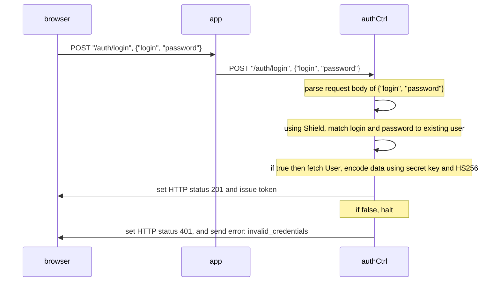
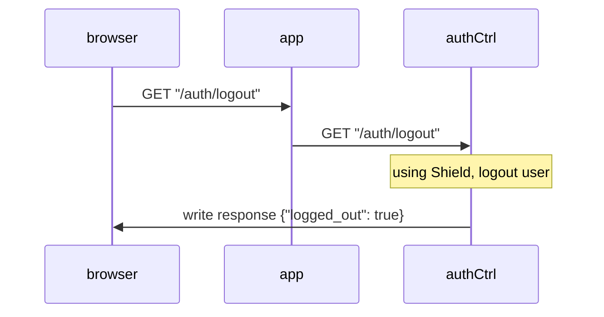

## Auth Controller

### LOGIN

```mermaid
sequenceDiagram
participant B as browser
participant A as app
participant Au as authCtrl

B ->> A: POST "/auth/login", {"login", "password"}
A ->> Au: POST "/auth/login", {"login", "password"}
Note over Au: parse request body of {"login", "password"}
Au ->> Au: 
Note over Au: using Shield, match login and password to existing user
Au ->> Au: 
Note over Au: if true then fetch User, encode data using secret key and HS256
Au ->> B: set HTTP status 201 and issue token

Note over Au: if false, halt
Au ->> B: set HTTP status 401, and send error: invalid_credentials
```

### LOGOUT

```mermaid
sequenceDiagram
participant B as browser
participant A as app
participant Au as authCtrl

B ->> A: GET "/auth/logout"
A ->> Au: GET "/auth/logout"
Note over Au: using Shield, logout user 
Au ->> B: write response {"logged_out": true} 
```