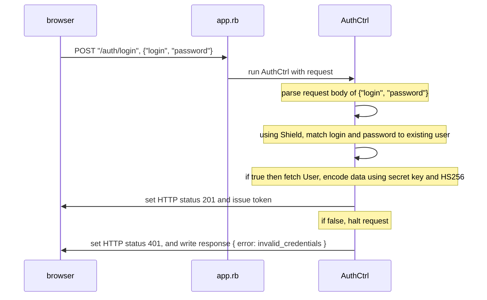
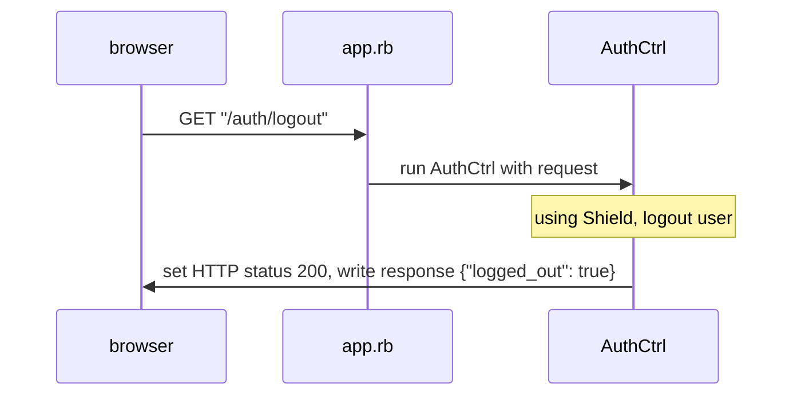
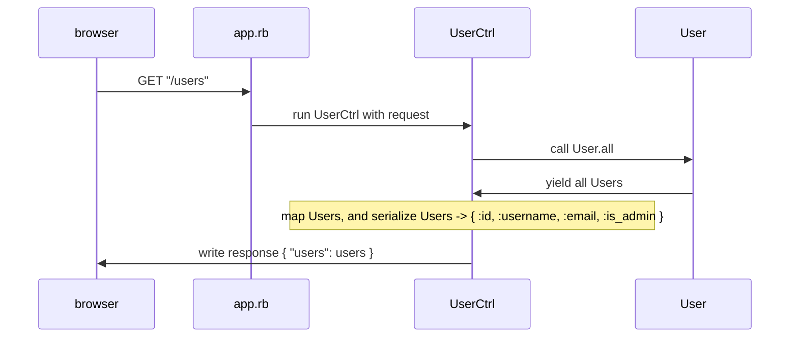
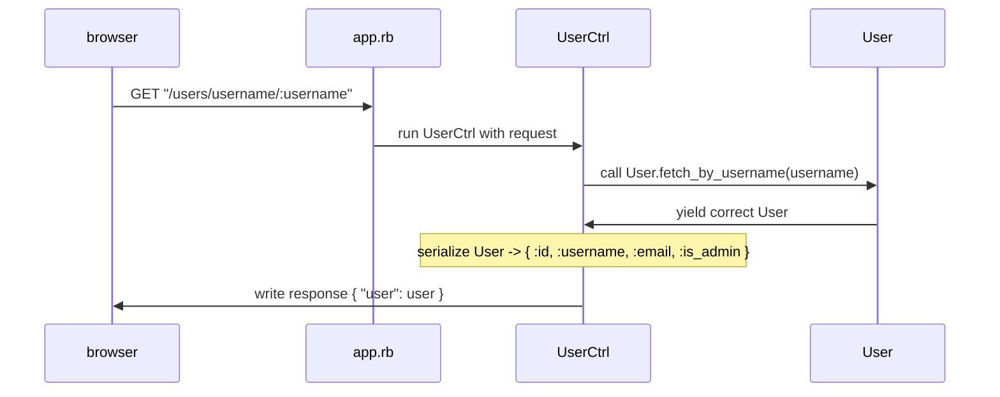

These sequence diagrams are easily viewed (and edited) on [StackEdit](https://stackedit.io/), using [MermaidJS](https://mermaidjs.github.io/).

## Auth Controller

### LOGIN

### LOGOUT

## USER CONTROLLER

### GET "/"

### GET "/users/username/:username"

